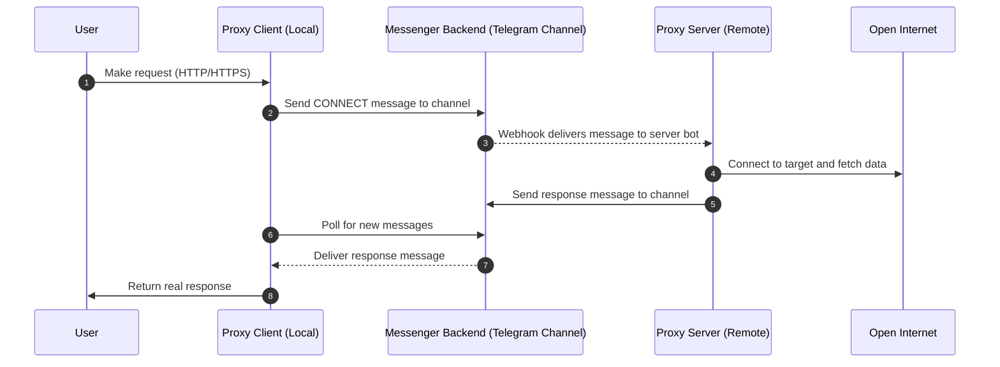

# Telegram (or Bale) as Proxy - Proof of Concept

This project shows how you can tunnel internet traffic through Telegram (or platforms with a similar backend, such as Bale) to get around firewalls and censorship.

## Concept

Messaging platforms usually have open access to the internet, even when other services are blocked. This proof-of-concept uses that fact to pass proxy traffic through a Telegram channel.

## How It Works

### Architecture Overview

The diagram below shows how the system works when the server bot uses a webhook.
In polling mode, the server does not receive updates from the messenger backend directly; instead, it repeatedly polls for new messages. The rest of the flow stays roughly the same.



### Communication Protocol

Bots talk using short text commands:

```
CONNECT {request_id} {host} {port}
OK {request_id} {stream_id}
SEND {stream_id} {base64_data}
RECV {stream_id} {base64_data}
CLOSE {stream_id}
CLOSED {stream_id}
```

### Why It Works

If Telegram is reachable, the tunnel works. Telegram’s backend has unrestricted internet access, so messages become the transport layer for the proxy.

#### Firewall Scenarios

* **Polling mode:** Works when outbound traffic is limited. The server bot polls Telegram for messages.
* **Webhook mode:** Works when inbound traffic is allowed. Telegram sends updates directly to the server.

The tunnel only needs one direction (inbound or outbound) to be open.

---

## Setup

### Requirements

* Python 3.12 or newer
* Two Telegram bot tokens
* One Telegram channel where both bots are admins
* A server outside the censored network

### Install

```bash
git clone <repository-url>
cd yes
uv sync
```

### Configuration

#### Client (local machine)

```bash
export CLIENT_BOT_TOKEN="your_client_bot_token"
export CHAT_ID="your_channel_id"
export BASE_URL="https://api.telegram.org/bot"
```

#### Server (external server)

```bash
export SERVER_BOT_TOKEN="your_server_bot_token"
export BASE_URL="https://api.telegram.org/bot"
```

### Running

Start the server bot:

```bash
python server.py
```

Start the client bot:

```bash
python client.py
```

Set your browser’s proxy to:

* Host: `127.0.0.1`
* Port: `8888`
* Protocol: HTTP/HTTPS

---

### Testing

Inside `client.py`, you can enable the test function:

```python
await test_connection()
```

---

## Limitations

* Slow due to Messenger rate limits
* Higher latency
* Depends on Messenger uptime
* Not built for heavy traffic

---

## Using Other Messengers

This can work with any platform that uses the Telegram API backend (like Soroush or Bale).
To switch, change the API base URL:

```bash
export BASE_URL="https://api.example.com/bot"
```

Platforms with different APIs require code changes.

---

## Technical Details

### Data Flow

1. Browser makes an HTTPS request
2. Client bot sends a `CONNECT` command
3. Server bot opens the connection
4. Data is exchanged using `SEND` and `RECV`
5. Both sides close the connection with `CLOSE` and `CLOSED`

### Connection Pooling

Both sides keep track of multiple active streams, which allows normal web browsing with several tabs and assets loading in parallel.

---

## Disclaimer

This project is for educational and research purposes only. Follow local laws and the terms of service of messaging platforms.
