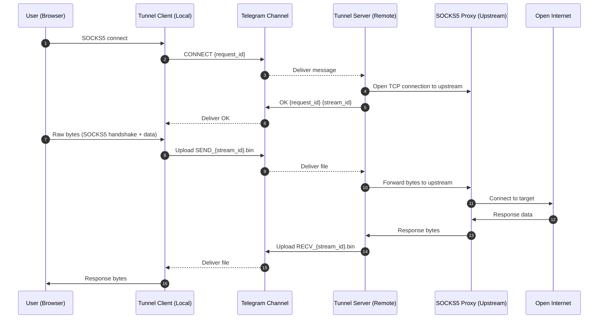

# Telegram (or Bale) as Proxy - Proof of Concept

This project shows how you can tunnel internet traffic through Telegram (or platforms with a similar backend, such as Bale) to get around firewalls and censorship.

## Concept

Messaging platforms usually have open access to the internet, even when other services are blocked. This proof-of-concept uses that fact to pass proxy traffic through a Telegram channel.

## How It Works

### Architecture Overview

The client is a transparent TCP tunnel — it does no protocol parsing. A standalone SOCKS5 proxy (e.g., microsocks) runs on the server side, and the server bot forwards all tunneled traffic to it. The user's browser talks SOCKS5 end-to-end through the tunnel.


```mermaid
sequenceDiagram
    autonumber

    participant U as User (Browser)
    participant C as Tunnel Client (Local)
    participant M as Telegram Channel
    participant S as Tunnel Server (Remote)
    participant P as SOCKS5 Proxy (Upstream)
    participant I as Open Internet

    U->>C: SOCKS5 connect
    C->>M: CONNECT {request_id}
    M-->>S: Deliver message
    S->>P: Open TCP connection to upstream
    S->>M: OK {request_id} {stream_id}
    M-->>C: Deliver OK
    U->>C: Raw bytes (SOCKS5 handshake + data)
    C->>M: Upload SEND_{stream_id}.bin
    M-->>S: Deliver file
    S->>P: Forward bytes to upstream
    P->>I: Connect to target
    I->>P: Response data
    P->>S: Response bytes
    S->>M: Upload RECV_{stream_id}.bin
    M-->>C: Deliver file
    C->>U: Response bytes
```

### Communication Protocol

The bots communicate using text commands and file uploads through the Telegram channel:

- **CONNECT {request_id}**: Client requests a new tunnel stream
- **OK {request_id} {stream_id}**: Server acknowledges, provides stream ID
- **SEND_{stream_id}.bin**: Client-to-server data (file upload)
- **RECV_{stream_id}.bin**: Server-to-client data (file upload)
- **CLOSE {stream_id}**: Client requests stream close
- **CLOSED {stream_id}**: Server confirms stream closed

### Why It Works

If Telegram is reachable, the tunnel works. Telegram's backend has unrestricted internet access, so messages become the transport layer for the proxy.

#### Firewall Scenarios

* **Polling mode:** Works when outbound traffic is limited. Both bots poll Telegram for messages.
* **Webhook mode:** Works when inbound traffic is allowed. Telegram sends updates directly to the bot.

The tunnel only needs one direction (inbound or outbound) to be open.

---

## Setup

### Requirements

* Python 3.12 or newer
* Two Telegram bot tokens
* One Telegram channel where both bots are admins
* A server outside the censored network with a SOCKS5 proxy (e.g., microsocks)

### Install

```bash
git clone <repository-url>
cd yes
uv sync
```

### Configuration

#### Client (local machine)

```bash
export CLIENT_BOT_TOKEN="your_client_bot_token"
export CHAT_ID="your_channel_id"
export BASE_URL="https://api.telegram.org/bot"   # optional, defaults to Telegram
export LISTEN_HOST="0.0.0.0"                      # optional, defaults to 0.0.0.0
export LISTEN_PORT="1080"                          # optional, defaults to 1080
```

#### Server (external server)

```bash
export SERVER_BOT_TOKEN="your_server_bot_token"
export BASE_URL="https://api.telegram.org/bot"    # optional, defaults to Telegram
export UPSTREAM_HOST="127.0.0.1"                   # SOCKS5 proxy host
export UPSTREAM_PORT="1080"                        # SOCKS5 proxy port
```

### Running

Start a SOCKS5 proxy on the server (e.g., microsocks):

```bash
microsocks -p 1080
```

Start the server bot:

```bash
uv run python server.py
```

Start the client bot on your local machine:

```bash
uv run python client.py
```

Then configure your browser or system to use `127.0.0.1:1080` as a SOCKS5 proxy.

### Docker Compose

The easiest way to run the full stack:

```bash
docker compose up --build
```

This starts three services:
- **socks-proxy**: microsocks SOCKS5 proxy
- **server**: tunnel server bot, forwards to socks-proxy
- **client**: tunnel client, exposes port 1080 locally

---

## Testing

```bash
curl --socks5 127.0.0.1:1080 http://httpbin.org/ip
```

---

## Limitations

* Slow due to Messenger rate limits
* Higher latency
* Depends on Messenger uptime
* Not built for heavy traffic
* Data is sent as raw binary files through Telegram — **not encrypted** beyond Telegram's own encryption
* Bot tokens should be kept secret
* This is a PoC and not intended for production use

## Using Other Messengers

This can work with any platform that uses the Telegram API backend (like Soroush or Bale).
To switch, change the API base URL:

```bash
export BASE_URL="https://api.example.com/bot"
```

Platforms with different APIs require code changes.

---

## Technical Details

### Data Flow

1. User's browser sends a SOCKS5 request to the local tunnel client
2. Client opens a tunnel stream by sending `CONNECT {request_id}` to the channel
3. Server picks up the message and connects to the upstream SOCKS5 proxy
4. Server responds with `OK {request_id} {stream_id}`
5. All bytes (including the SOCKS5 handshake) are relayed transparently via file uploads
6. Connections are closed with `CLOSE`/`CLOSED` commands

### Connection Pooling

Both sides keep track of multiple active streams, which allows normal web browsing with several tabs and assets loading in parallel.

---

## Disclaimer

This project is for educational and research purposes only. Follow local laws and the terms of service of messaging platforms.
